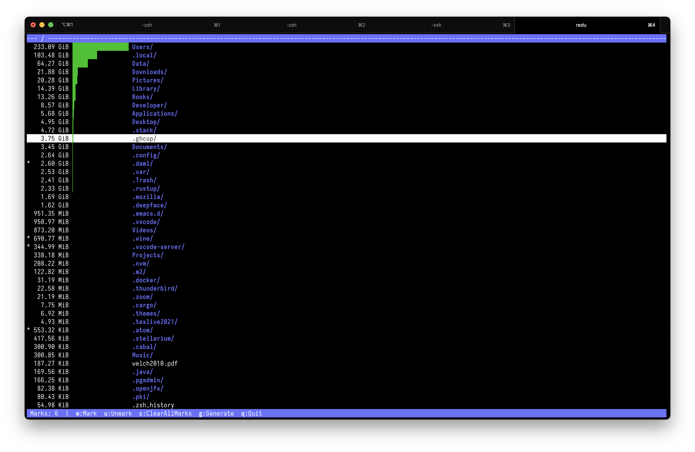

# Introduction

redu in a nutshell: it's ncdu for your restic repo.

If you ever wanted to know what's taking so much space in your restic
repo so that you can find all the caches and useless things you might be backing
up and delete them from the snapshots, then this is exactly for you.

redu aggregates data from **all** snapshots into one view so you can easily find
the culprits!

# Installing

You can either grab a pre-built binary from Github, currently available for:
- Darwin (macos) arm64
- Linux arm64
- Linux amd64

or you can install with cargo:
```
cargo install redu
```
Note: it currently requires nightly to build.
 
# Running
 
You can use all the regular restic environment variables, they will be passed
to all restic subprocesses redu spawns.

For example:
```
$ export RESTIC_REPOSITORY='sftp://my-backup-server.my-domain.net'
$ export RESTIC_PASSWORD_COMMAND='security find-generic-password -s restic -a personal -w'
$ redu 
```

Alternatively, you can pass the repo and the password as arguments to redu:
```
redu -r 'sftp://my-backup-server.my-domain.net' --password-command 'security find-generic-password -s restic -a personal -w' 
```

# Usage
Redu keeps a cache with your file/directory sizes (per repo).
On each run it will sync the cache with the snapshots in your repo,
deleting old snapshots and integrating new ones into the cache.

If you have a lot of large snapshots the first sync might take some minutes
depending on your connection speed and computer.
It will be much faster the next time as it no longer needs to fetch the entire repo.

After some time you will see something like this:



You can navigate using the **arrow keys** or **hjkl**.
Going right enters a directory and going left leaves back to the parent.

The size that redu shows for each item is the maximum size of the item
across all snapshots. That is, it's the size of that item for the snapshot
where it is the biggest.

The bars indicate the relative size of the item compared to everything else
in the current location.

### Marking files 
You can mark files and directories to build up your list of things to exclude.
Keybinds
- **m**: mark selected file/directory
- **u**: unmark selected file/directory
- **c**: clear all marks
 
The marks are persistent across runs of redu (they are saved in the cache file),
so feel free to mark a few files and just quit and come back later.

### Generating the excludes
Press **g** to exit redu and generate a list with all of your marks in alphabetic order to stdout.

Everything else that redu prints (including the UI itself) goes to stderr,
so this allows you to redirect redu's output to a file to get an exclude-file
that you can directly use with restic.

For example:
```
$ redu > exclude.txt
$ restic rewrite --exclude-file=exclude.txt --forget
```

Note: redu is strictly **read-only** and will never modify your repository itself.

### Quit
You can also just quit without generating the list by pressing **q**.

# Contributing
Bug reports, feature requests and PRs are all welcome!
Just go ahead!

You can also shoot me an email or talk to me on the rust Discord or Freenode
if you want to contribute and want to discuss some point.

### Tests and Benchmarks
You can run the tests with
```
cargo test
```

There are also a couple of benchmarks based on criterion that can be run with
```
cargo bench --features bench
```